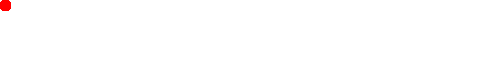
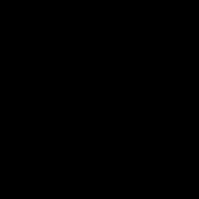

# Advent of Code 2019 Extras
This space highlight some of the more creative solutions I designed on top of the straight forward solutions in the [main section](../README.md), including additional information and showcases.

## Day 8 - Animation using Python and Gimp

Part 2 of day 8 required mashing together a bunch of layers to get to the final solution. While this can be done in code alone, I decided to solve the puzzle with an animated GIF. My [python script](../2019_08_animation.py) creates a transparent image for each layer and saves it to the disk (in ./images/, which has to be created manually in advance, if you want to try it yourself).

Afterwards, all you have to do is import the result in Gimp, tinker with the background and the timing as you please, and save it as animated GIF.

Here is the result for my input:

## Day 11 - Another Animation using Python and Gimp

I could reuse some of my code from day 8 to create an animation for day 11 as well. Again, I used my [python script](../2019_11_animation.py) to generate the individual images and did the rest with Gimp.

Watch my little robot paint the hull:

## Day 15 - Flooding the Area with Oxygen

Still sticking to my guns with Python and Gimp. Today my [python script](../2019_15_animation.py) floods the base with oxygen:

## Day 23 - Network Analysis

It is time for one more animation. Watch my [python script](../2019_23_animation.py) analyze the network load distribution in our virtual IntCode network:

# About the Author

If you like my work, follow me on [Twitter](https://twitter.com/Dementophobia), so that you won't miss any new solutions that I publish. You can also drop me a message there, to get in contact with me.